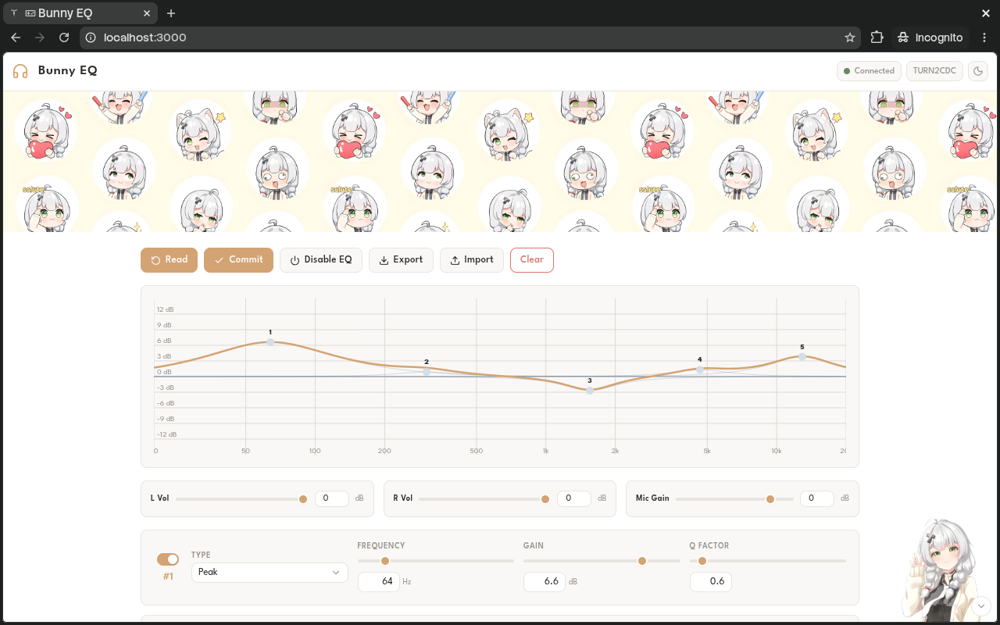
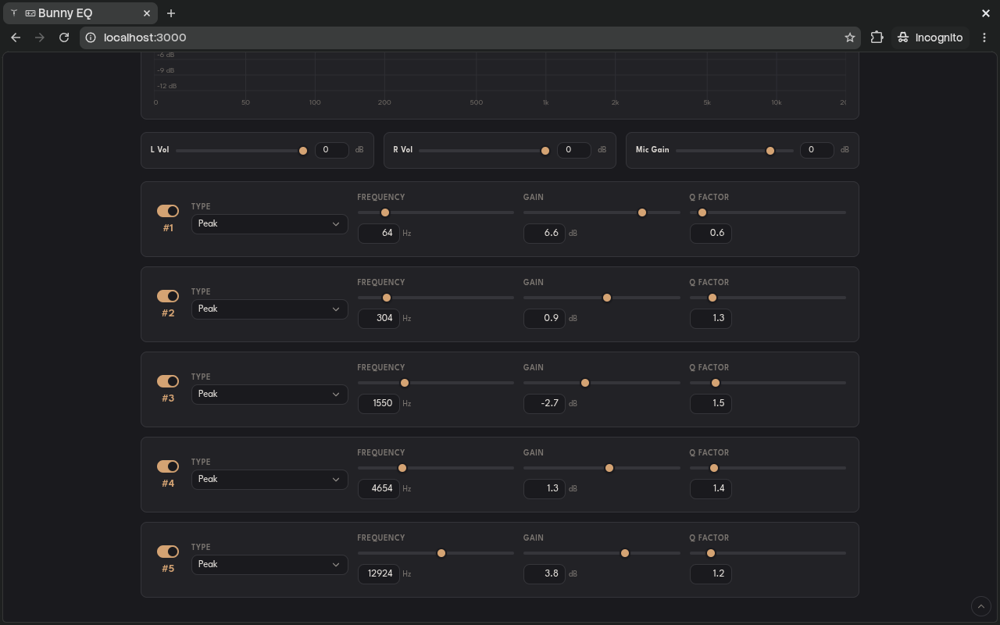

# Bunny EQ

Lightweight web and Android EQ controller for the Tanchjim Bunny DSP (KTMicro DAC/DSP)

<p align="center">
  
  
</p>

## Features

- **5-Band Parametric EQ:** Supports Peak (`PK`), Low Shelf (`LSQ`), and High Shelf (`HSQ`) filters with interactive draggable response curve
- **Filter Controls:** Gain (±12 dB in 0.1 dB steps), Q factor (0.1 to 10.0), frequency (20 Hz to 20 kHz), and per-band bypass toggles
- **Levels & Routing:** Independent Left/Right digital volume (-60 dB to 0 dB) and ADC microphone gain (-60 dB to +12 dB)
- **Profile Management:** Read from / commit to hardware via WebHID (or Android USB Host), global EQ bypass, and `.json` preset import/export
- **Cross-Platform:** Available as a zero-install web app and native Android app

## Web

Use directly in any Chromium-based browser (Chrome, Edge, Brave):

[vzpyr.github.io/bunnyeq](https://vzpyr.github.io/bunnyeq)

## Installation

Download the pre-built APK from the [Releases](https://github.com/vzpyr/bunnyeq/releases) page:

- **Android:** `.apk`

## Building from Source

### Prerequisites

- Node.js 18+ and npm
- Android SDK & JDK 17+

### Android

```bash
cd android
npm install
npm run build
```

Compiled APK lands in `android/android/app/build/outputs/apk/debug/`

## Permissions

### Web

Allow the WebHID device prompt when clicking Connect. On Linux, create a udev rule so the browser can open the HID interface (WebHID uses hidraw), then reload and reapply the rules:

```bash
sudo tee /etc/udev/rules.d/99-bunny.rules <<'EOF'
SUBSYSTEM=="hidraw", ATTRS{idVendor}=="31b2", MODE="0666"
EOF
sudo udevadm control --reload-rules && sudo udevadm trigger --subsystem-match=hidraw
```

Replug the device if the browser still can't connect after applying the rules. Flatpak and Snap browsers run sandboxed: connect the device before launching the browser and grant the app USB hardware access (Flatpak: `flatpak override --user --device=all org.chromium.Chromium`, then restart).

### Android

Allow the USB permission prompt when plugging in the Bunny DSP.

## References

Reverse-engineered from:

- Tanchjim Android app decompilation ([REGISTER-MAP.md](REGISTER-MAP.md))
- [jeromeof/devicePEQ](https://github.com/jeromeof/devicePEQ) (`ktmicroUsbHidHandler.js` and device definitions)
- USB packet captures & HID interface 3 descriptor dumps on firmware v1.01 hardware

## License

MIT
